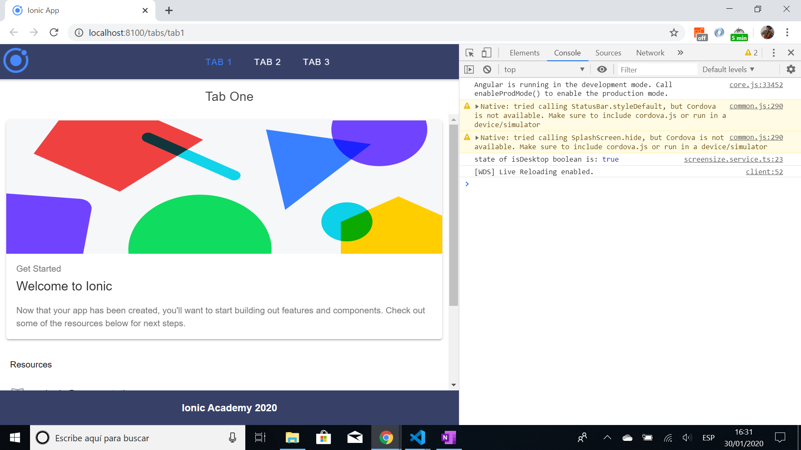
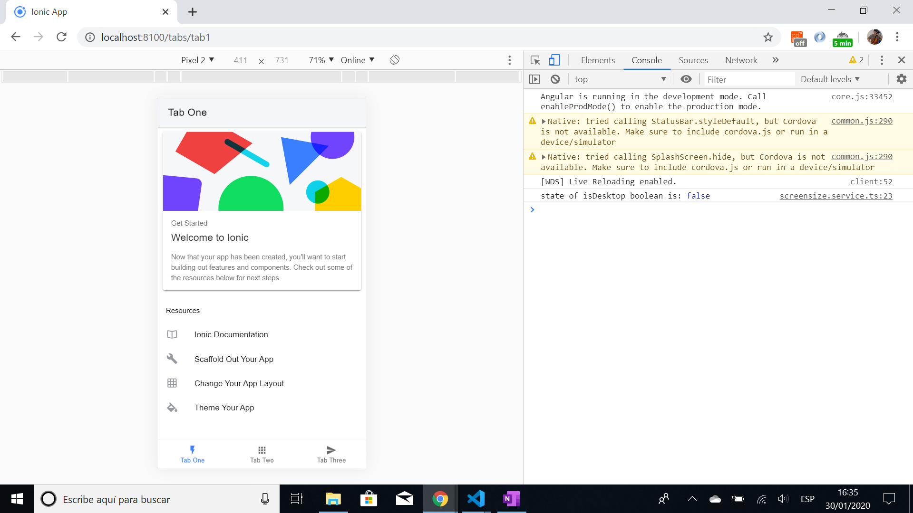

# :zap: Ionic Horizontal Navigation

* Ionic-Angular tutorial app to switch from tabs to top nav bar as screen size increases
* Tutorial code from [Simon Grimm at Devdactic](https://devdactic.com/) - see [:clap: Inspiration](#clap-inspiration) below
* **Note:** to open web links in a new window use: _ctrl+click on link_


## :page_facing_up: Table of contents

* [:zap: Ionic Horizontal Navigation](#zap-ionic-horizontal-navigation)
  * [:page_facing_up: Table of contents](#page_facing_up-table-of-contents)
  * [:books: General info](#books-general-info)
  * [:camera: Screenshots](#camera-screenshots)
  * [:signal_strength: Technologies](#signal_strength-technologies)
  * [:floppy_disk: Setup](#floppy_disk-setup)
  * [:computer: Code Examples](#computer-code-examples)
  * [:cool: Features](#cool-features)
  * [:clipboard: Status & To-do list](#clipboard-status--to-do-list)
  * [:clap: Inspiration](#clap-inspiration)
  * [:file_folder: License](#file_folder-license)
  * [:envelope: Contact](#envelope-contact)

## :books: General info

* Uses a simple screensize service with a BehaviourSubject that is used in app.component and subscribed to in the tabs page. So when the screen size exceeds 568px then a boolean 'isDesktop' observable changes state. This is used in the tabs page to change the bottom tabs toolbar to a top nav bar using the Angular *ngIf="isDesktop'.
* Note: screen reloads when going from PC to phone size - due to an issue with the tabs routing.

## :camera: Screenshots




## :signal_strength: Technologies

* [Ionic v6](https://ionicframework.com/)
* [Angular v13](https://angular.io/)
* [Ionic/angular v6](https://www.npmjs.com/package/@ionic/angular) including [ion-nav-link](https://ionicframework.com/docs/api/nav-link)

## :floppy_disk: Setup

* `npm i` to install dependencies
* `ionic serve` to start the server on _localhost://8100_

## :computer: Code Examples

* service to change state of an observable when screen size hits a breakpoint of 568px.

```typescript
export class ScreensizeService {

  private isDesktop = new BehaviorSubject<boolean>(false);

  constructor() { }

  onResize(size: number) {
    if (size < 568) {
      this.isDesktop.next(false);
    } else {
      this.isDesktop.next(true);
    }
  }

  isDesktopView(): Observable<boolean> {
    console.log('state of isDesktop boolean is:', this.isDesktop.value);
    return this.isDesktop.asObservable().pipe(distinctUntilChanged());
  }
}
```

## :cool: Features

* Uses the RxJS [distinctUntilChanged](https://www.learnrxjs.io/learn-rxjs/operators/filtering/distinctuntilchanged) to only emit an observable change of state when it is actually different.

## :clipboard: Status & To-do list

* Status: Working
* To-do: nothing. Could use this in other Ionic apps.

## :clap: Inspiration

* [Simon Grimm, Ionic Academy Tutorial: How to Create a Horizontal Navigation for Ionic Desktop Views](https://devdactic.com/horizontal-navigation-ionic-desktop/)

## :file_folder: License

* This project is licensed under the terms of the MIT license.

## :envelope: Contact

* Repo created by [ABateman](https://github.com/AndrewJBateman), email: gomezbateman@yahoo.com
